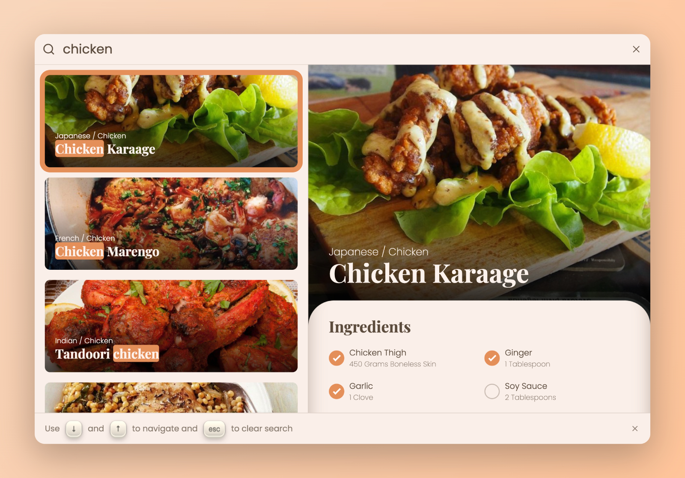
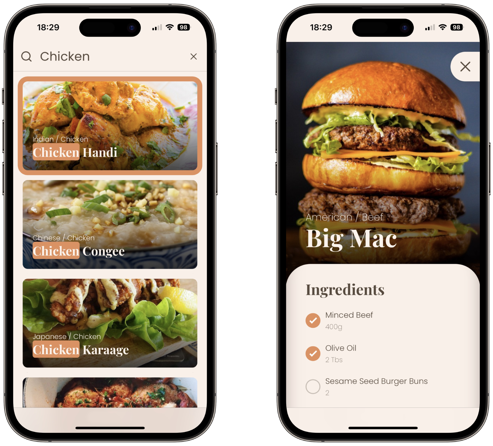

<div align="center">
  
  <h1 align="center">Recipe App</h1>
  <p align="center"><strong>Discover recipes with a responsive autocomplete app</strong></p>
</div>

Initially developed as part of a take-home assessment for a job application, this project has been refined and is now
available as a reference for those facing similar challenges. It features a responsive autocomplete component with text
highlighting and keyboard navigation. Notably, it does not use any third-party libraries beyond the essentials: React,
TypeScript, and Vite.

## Screenshots

<div align="center">
  
</div>

<div align="center">
  
</div>

## Features

- **⌨️ Keyboard navigation:** Users can navigate through the autocomplete suggestions using the arrow keys and clear the
  search input with the escape key.
- **✨ Text highlighting:** Autocomplete suggestions highlight the part of the text that matches the user's input.
- **📱 Responsive design:** Fully responsive, ensuring a great user experience on both desktop and mobile devices.
- **🛠️ No third-party libraries:** Built-in logic for autocomplete functionality without external dependencies.

## Tech Stack

- React 18
- TypeScript
- Vite
- CSS with BEM methodology

## Data Source

This app uses the [TheMealDB API](https://www.themealdb.com/api.php) to fetch cooking recipes.

## Getting Started

### Installation

1. Clone the repository:
   ```bash
   git clone https://github.com/jorgecancinof/recipe-app.git && cd recipe-app
   ```

2. This project uses Node.js LTS version 20.14.0. If you have a Node.js version manager
   (e.g., [NVM](https://github.com/nvm-sh/nvm), [FNM](https://github.com/Schniz/fnm), [Volta](https://volta.sh/)),
   the [`.nvmrc`](.nvmrc) file will help you switch to this version automatically.

3. Install the dependencies:
   ```bash
   npm ci
   ```

### Running the Project

1. Start the development server:
   ```bash
   npm run dev
   ```

2. Open the localhost URL provided by Vite to access the app.

## License

This project is licensed under the [MIT License](LICENSE).
