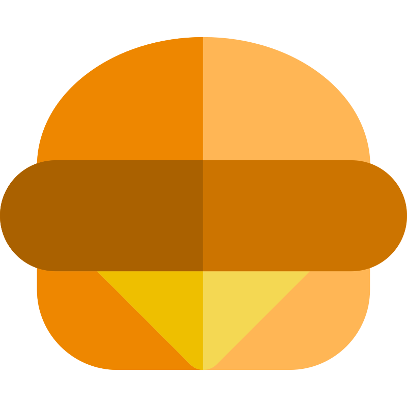

<div align="center">
  
  <h1 align="center">Recipe App</h1>
  <h3 align="center">Discover recipes quickly with a responsive autocomplete app</h3>
</div>

Initially developed as part of a take-home assessment for a job application, this project has been refined and made
available as a demonstration of my skills. It features a custom autocomplete component with text highlighting and
keyboard navigation. Fully responsive, it works seamlessly on both mobile and desktop devices.

## Screenshots

<div align="center">
  
</div>

<div align="center">
  
</div>

## Features

- **⌨️ Keyboard navigation:** Users can navigate through the autocomplete suggestions using the arrow keys and clear the
  search input with the escape key.
- **✨ Text highlighting:** Autocomplete suggestions highlight the part of the text that matches the user's input.
- **📱 Responsive design:** Fully responsive, ensuring a great user experience on both desktop and mobile devices.
- **🛠️ No third-party libraries:** Built-in logic for autocomplete functionality without external dependencies.

## Tech stack

- React 18
- TypeScript
- CSS with BEM methodology
- Vite

## Data source

This app uses the [TheMealDB API](https://www.themealdb.com/api.php) to fetch cooking recipes.

## Setup and running the project

### Prerequisites

Ensure you have the latest LTS version of Node.js installed.

### Installation

1. Clone the repository.

2. Install the dependencies:
    ```bash
    npm install
    ```

### Running the project

1. To start the development server:
   ```bash
   npm run dev
   ```

2. Open the localhost URL shown in the terminal to view the app.

## License

This project is licensed under the [MIT License](LICENSE).
